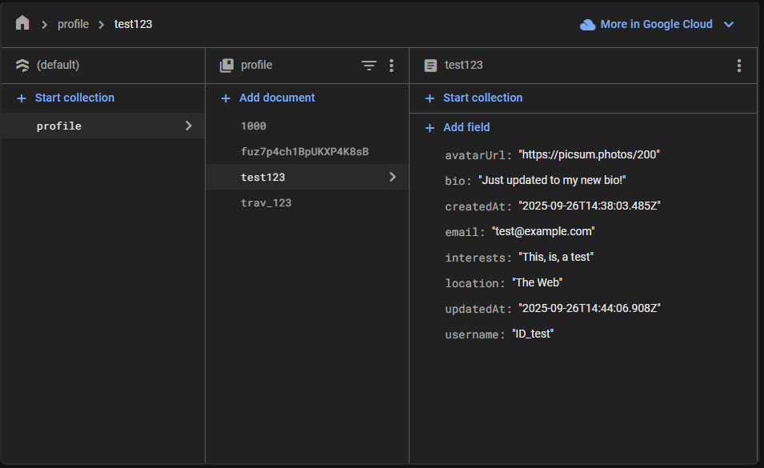
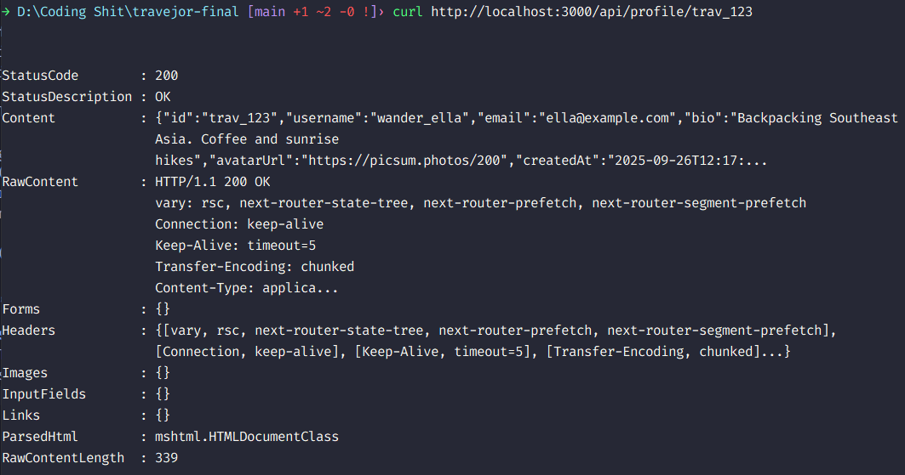
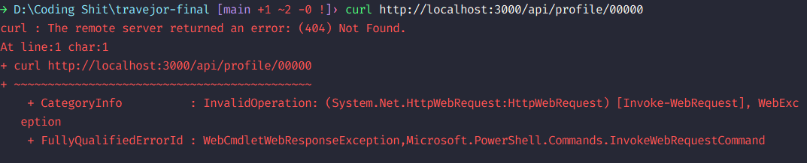
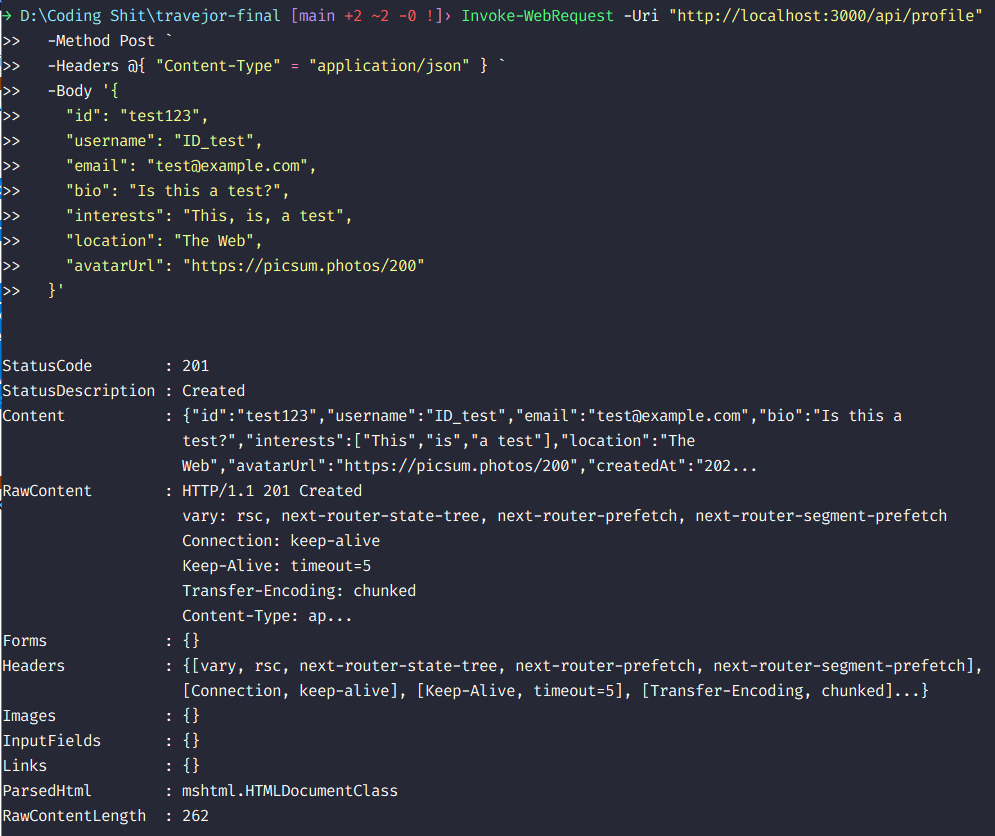
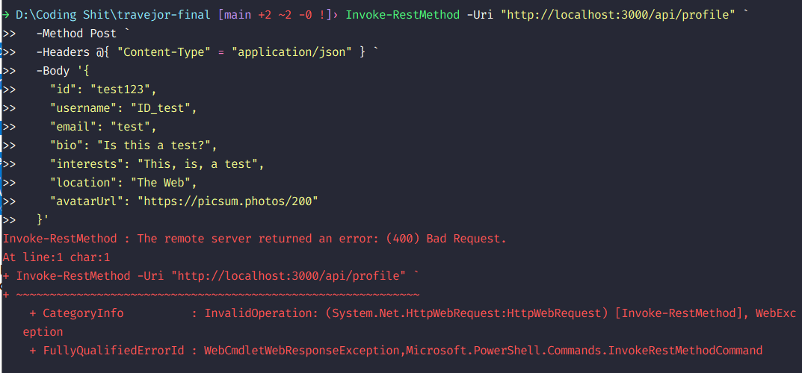
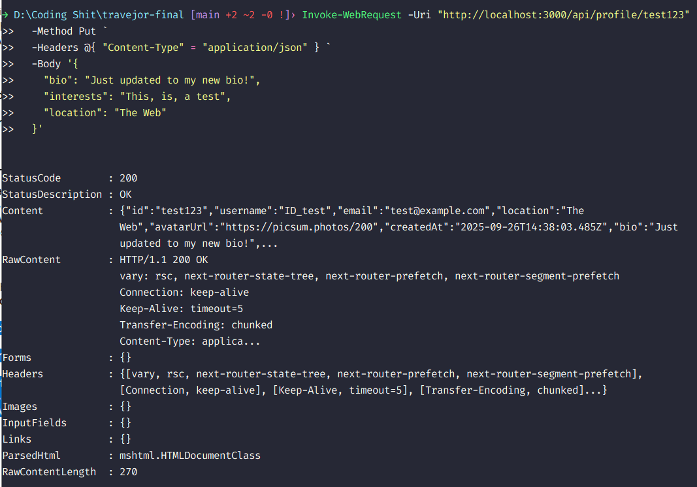

# Travejor - Backend Developer Coding Challenge

### Goal

Build a small feature slice for traveler profiles consisting of:

1. A backend API for creating, retrieving, and updating profiles.

2. A simple web profile page that consumes the API and displays a traveler’s details.

## Tech Stack

This submission was made using NextJS framework and Firestore.

The choice for NextJS was simple, it provided a simple and easy integration of both frontend and backend functionality. Because of how Next works, it has a built-in API routes that could host its own REST API backend server, and with NextJS being implemented with ReactJS as well, could act as a full-stack framework. As well as myself having experience with using it.

For Firestore, besides it being a recommended database, Google Firebase is already the most well-known and well-documented database storage, authentication, hosting, and backend service platform. Cloud Firestore specifically is a database storage service, that uses NoSQL, which is a non-relational database. Being it the most reliable backend service as well as having experience with it myself, it was the obvious choice. A more indepth explanation is given below

Since NextJS has Vercel hosting support, the submission itself can be previewed both offline and online.

### https://travejor-final.vercel.app

## Environment Variables

As per best practices and Google policy, this project does not contain an .env file.

The environment variable is a private API key needed to connect to the Firestore API.

If you have access to the given .env file, it should be within the root directory of the repository

## Getting Started

This project runs on Node v20.17.0 and npm v10.9.0

Clone the repository by following the instructions above, then run

```bash
npm install
```

to get all the dependencies and packages needed to run this offline.

Run the development server:

```bash
npm run dev
# or
yarn dev
# or
pnpm dev
# or
bun dev
```

Open [http://localhost:3000](http://localhost:3000) with your browser to see the result.

## Backend

The backend functionality consists of two things, the REST API endpoint service done and integrated within NextJS, and the database service by Firestore.

All API endpoints and RESTful requests are within the src/app/api subdirectories.

Firestore is a non-relational database, hence it is stored via documents and collections


As shown above, the profile collections contains all profile documents, where in each document is named after its ID (is unique and can be auto-generated or user-generated). In it contains all the profile fields.

Validation is done by the backend and is invoked before the API request.

## Seed Profiles for Testing

The following are existing IDs that could be fetched:

1. 1000
2. kg0T6rmUmqTBJ1GilJjU
3. trav_123

NOTE: The avatarUrl makes use of the picsum.photos API, which generates a random image. Images may or may not be always the same when reloading.

## Sample API Requests

### Backend API Requirements

Endpoints (REST or GraphQL):

- POST /profile → Create a new traveler profile
- GET /profile/:id → Retrieve a traveler profile
- PUT /profile/:id → Update a traveler profile

Profile fields:

- id (string or UUID)
- username (string, unique if possible)
- email (string)
- bio (string)
- interests (array of strings, e.g., ["hiking", "food", "trips"])
- location (city, country)
- avatarUrl (string, optional)
- createdAt, updatedAt

### Examples

Request: GET existing ID

Expected Response: Status 200 and User information


Request: GET non-existent ID

Expected Response: Status 404


Request: POST new valid user

Expected Response: Status 201


Request: POST invalid user

Expected Response: Status 400


Request: PUT edit user content

Expected Response: Status 200


## Notes

Due to the limited time given, there were alot of shortcuts taken, such as lack of more thorough testing and edge-cases, as well as the rushed prototype created that does the job yet lacks aesthetics. The optional bonus points of having authentication protection on endpoints we're considered but was not developed in time. The project source code itself also may lack some thorough documentation.

Late Note: Had to rebuild the Firestore service as Google locked access to the project, and tried to troubleshoot it for an hour only to no avail and just had to rebuild the Firestore project all over again.
